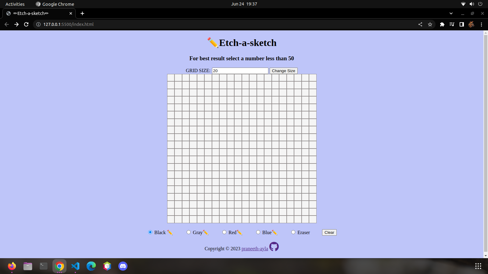

# Etch-a-Sketch

Etch-a-Sketch is a simple web-based drawing application where you can create colorful sketches on a grid. It allows you to select different colors and draw by hovering the mouse over the grid cells.

##Features
*Adjustable grid size: You can change the size of the drawing grid to create larger or smaller sketches.
*Color selection: Choose from a range of colors including black, gray, red, blue, and an eraser option.
*Mouse drawing: Simply hover the mouse over the grid cells to draw with the selected color.
*Clear functionality: Clear the entire grid to start a new drawing.

##How to Use
*Open the index.html file in a web browser.
*On the web page, you'll find an input field labeled "GRID SIZE" where you can enter the desired grid size. It's recommended to choose a number less than 50 for optimal performance.
*Click the "Change Size" button to create the grid with the specified size.
*Use the radio buttons to select the color you want to draw with.
*Click and drag the mouse over the grid cells to draw using the selected color.
*To clear the entire grid and start a new drawing, click the "Clear" button.

##Technologies Used
*HTML
*CSS
*JavaScript

##Compatibility
The Etch-a-Sketch application should work in modern web browsers that support HTML5, CSS3, and JavaScript. It has been tested on Google Chrome and Mozilla Firefox.